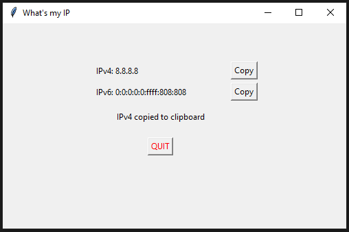

# What's my IP

A simple GUI python application to display your public IP addresses (v4 & v6).

To install dependencies use:

`pip install -r requirements.txt`

## Download

- [Linux](https://github.com/msaarmets/whats-my-ip/raw/master/dist/Whats-my-IP)
- [Windows](https://github.com/msaarmets/whats-my-ip/raw/master/dist/Whats-my-IP.exe) (x64)
